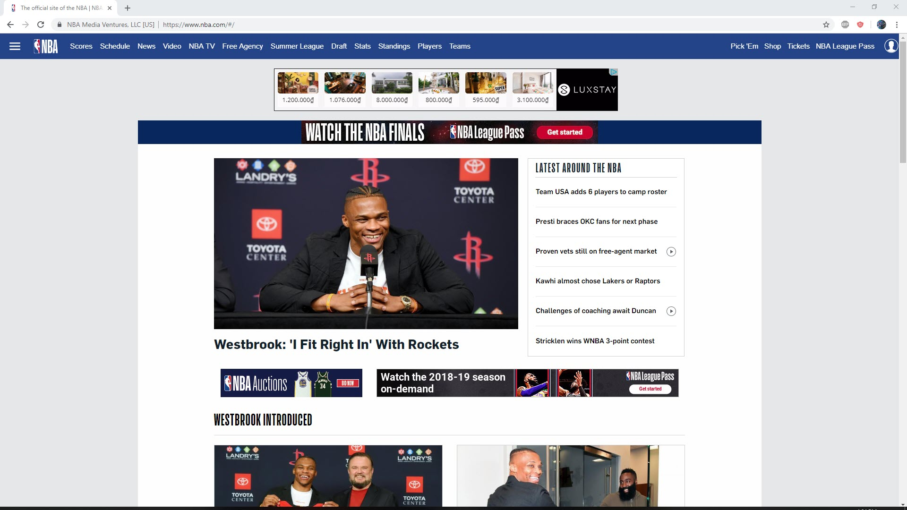
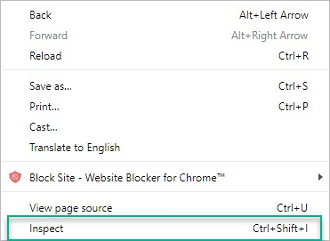
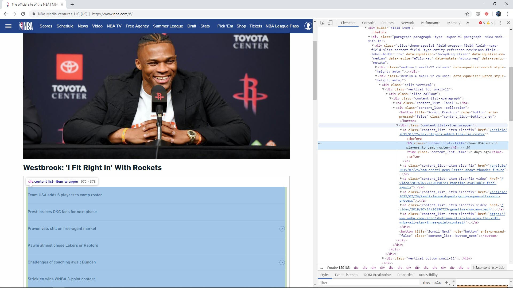
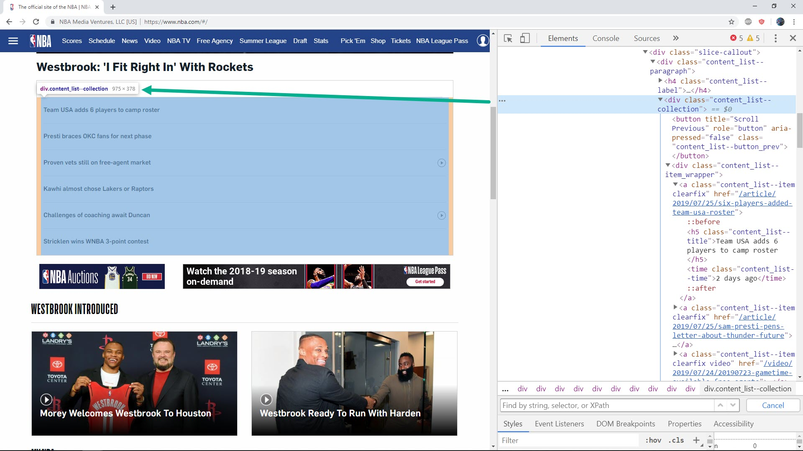

### Inspecting Web Page with Chrome Developer Tool

In this chapter we will go in deep detail how to use `Chrome Developer Tool` to inspect web page.

At end of this chapter you will understand how to do inspecting web page and have clear strategies to scrape data from HTML page.

We will use [NBA](https://www.nba.com/#/) for our demo, let access NBA with Chrome browser.

#### Chrome Developer Tool

We will use `Chrome Developer Tool` to inspect NBA home page. Now mouse over web page then right click, then select `Inspect` from context menu.

A panel will open and show up corespond HTML content of NBA home page. We saw that HTML show on a tree structure and very easy to navigate from tag to tag.

#### Example 1 : Inspect NBA News

Suppose we want to scrape all ***title and link*** inside the box "LATEST AROUND THE NBA".

Move mouse up and down on HTML tree view to findout what web page items is selected when we select corespond tag.

We found that when mouse select `div` tag which has class name `content_list--collection`, the whole news area will be selected. So the first step should be find the `div` tag with class name `content_list--collection`.

Now after 

#### Example 2 : Inspect NBA Players