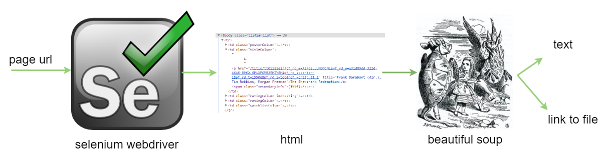

#### The Big Picture

We will take overview on common steps when doing web scraping. Actually this is a really simple process.

**Step 1** : Web scraping task always start with a web page and information we want to scrape. The first step we need to understand web page and find out  HTML tags contain our wanted data. Result from this step will be used in final step to actually scrape data.

**Step 2** : Wanted Data is located inside HTML page, so need to download HTML content to local. We will use Selenium for downloading web page.

**Step 3** : After have HTML content, we use Beautiful Soup to parse it. After parse we will easily search for HTML tags which contain our data.

**Step 4** : Final step is about scrape data then store to file  or database. In this book we will make it simply by store data to file.

#### Selenium

We use <a href="https://www.seleniumhq.org/" target="_blank">Selenium</a> to control browser and download HTML content.

Why we not just use library like requests to download HTML content ?. Have 2 reason why we want to use Selenium :

* Many modern web page use a lot of JavaScript for dynamic render, requests package could not render HTML from JavaScript.
* In some web pages, in order access wanted data, we need to do actions like : login, click link to navigate. Selenium can do that perfectly.

#### Beautiful Soup

After use Selenium to render HTML content from URL, We need [Beautiful Soup](https://www.crummy.com/software/BeautifulSoup/bs4/doc/) to parse HTML in to object. Beautiful Soup provide functions help us to search HTML tags inside HTML object.

After have HTML tags, final step just about access wanted data and save it.
